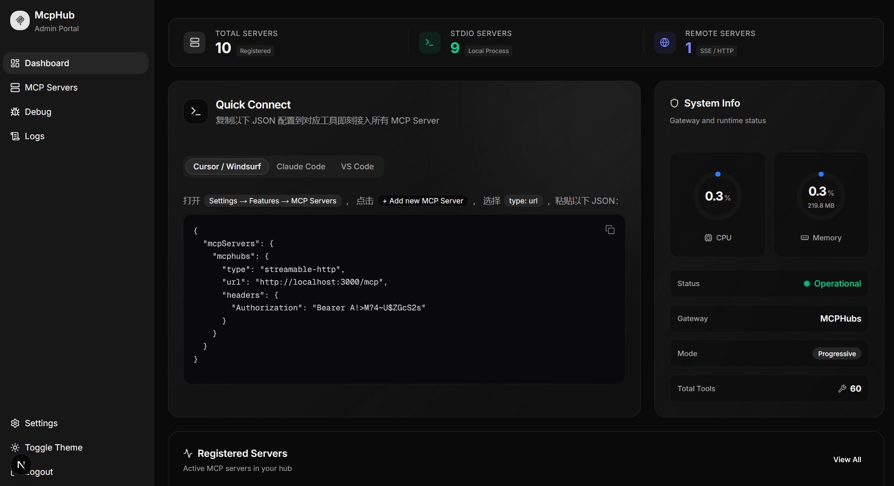
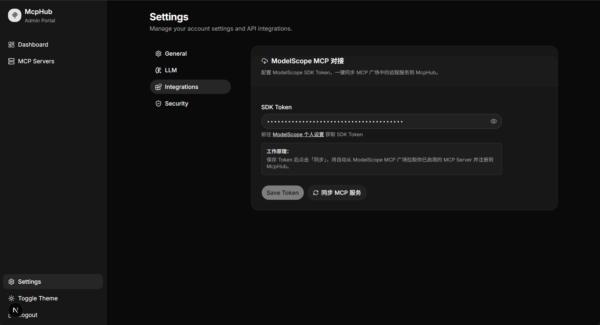

# MCPHubs

**The MCP gateway that doesn't overwhelm your AI.**

[中文文档](./README_zh.md)

---

## Why MCPHubs?

MCP is powerful — but naive aggregation is not. When you wire up 10+ MCP Servers, your LLM is force-fed hundreds of tool definitions on every single request — burning tokens, inflating costs, and degrading decision quality.

**MCPHubs fixes this with Progressive Disclosure.**

Instead of dumping every tool into the system prompt, MCPHubs exposes a lean surface of just **4 meta-tools**. Your AI discovers servers, inspects their capabilities, and calls the right tool — all on demand, with zero upfront overhead.

```
┌─────────────────────────────────────────────────────────────────────┐
│                        Without MCPHubs                              │
│                                                                     │
│  AI System Prompt:                                                  │
│  ├── tool_1 definition (search)              }                      │
│  ├── tool_2 definition (fetch_article)       }  150 tool schemas    │
│  ├── tool_3 definition (create_issue)        }  = ~8,000 tokens     │
│  ├── ...                                     }  EVERY request       │
│  └── tool_150 definition (run_analysis)      }                      │
└─────────────────────────────────────────────────────────────────────┘

┌─────────────────────────────────────────────────────────────────────┐
│                         With MCPHubs                                │
│                                                                     │
│  AI System Prompt:                                                  │
│  ├── list_servers    "discover available servers"   }               │
│  ├── list_tools      "inspect a server's tools"    }  4 tools       │
│  ├── call_tool       "invoke any tool"             }  = ~400 tokens │
│  └── refresh_tools   "refresh tool cache"          }  EVERY request │
│                                                                     │
│  AI discovers and calls the right tool when needed. Not before.     │
└─────────────────────────────────────────────────────────────────────┘
```



## How Progressive Disclosure Works

MCPHubs collapses all your MCP Servers into **4 meta-tools**:

| Meta-Tool | Purpose |
|---|---|
| `list_servers` | Discover available MCP Servers |
| `list_tools` | Inspect tools on a specific server |
| `call_tool` | Invoke any tool on any server |
| `refresh_tools` | Refresh a server's tool cache |

The AI explores your tool ecosystem **on demand** — it calls `list_servers` to see what's available, drills into a server with `list_tools`, and invokes the right tool via `call_tool`. No upfront cost, no bloat.

> Don't need progressive disclosure? Set `MCPHUBS_EXPOSURE_MODE=full` and MCPHubs becomes a straightforward aggregation gateway — all tools from all servers exposed directly.

## ✨ Features

| | |
|---|---|
| 🎯 **Progressive Disclosure** | 4 meta-tools, infinite capabilities. Tools loaded on demand |
| 🔀 **Multi-Protocol Gateway** | Unifies stdio, SSE, and Streamable HTTP behind one endpoint |
| 🖥️ **Web Dashboard** | Modern Next.js UI for managing servers, bulk import/export |
| 📦 **One-Click Import** | Auto-detects Claude Desktop, VS Code, and generic JSON configs |
| 🤖 **LLM Descriptions** | Auto-generates server summaries via OpenAI-compatible APIs |
| 🔐 **API Key Auth** | Bearer Token protection on the `/mcp` endpoint |
| 🌟 **ModelScope Sync** | Import from [ModelScope MCP Marketplace](https://modelscope.cn/home) |

### ModelScope Integration



## 🏗 Architecture

```
AI Client ──▶ Streamable HTTP ──▶ MCPHubs Gateway ──┬─ stdio servers
                                       │            ├─ SSE servers
                                  PostgreSQL         └─ HTTP servers
                                       │
                                  Web Dashboard
```

## 🚀 Quick Start

### Docker Compose (Recommended)

```bash
git clone https://github.com/7-e1even/MCPHubs.git && cd MCPHubs
cp .env.example .env        # edit as needed
docker compose up -d
```

Open `http://localhost:3000` — login with `admin` / `admin123`.

### Local Development

**Backend:**

```bash
pip install -r requirements.txt
cp .env.example .env
python main.py serve
```

**Frontend (dev):**

```bash
cd web
npm install
npm run dev
```

**Frontend (production):**

```bash
cd web && npm install && npm run build && npm run start
```

## 🔌 Connect Your AI Client

Add MCPHubs as a single MCP endpoint:

```json
{
  "mcpServers": {
    "mcphubs": {
      "url": "http://localhost:8000/mcp"
    }
  }
}
```

With API Key authentication:

```json
{
  "mcpServers": {
    "mcphubs": {
      "url": "http://localhost:8000/mcp",
      "headers": {
        "Authorization": "Bearer YOUR_API_KEY"
      }
    }
  }
}
```

That's it. Your AI now has access to **every tool on every server** through progressive discovery — without seeing any of them upfront.

## ⚙️ Configuration

| Variable | Default | Description |
|---|---|---|
| `MCPHUBS_EXPOSURE_MODE` | `progressive` | `progressive` (4 meta-tools) or `full` (passthrough) |
| `MCPHUBS_DATABASE_URL` | `postgresql+asyncpg://...` | PostgreSQL connection string |
| `MCPHUBS_API_KEY` | *(empty)* | Bearer Token for `/mcp` (empty = no auth) |
| `MCPHUBS_HOST` | `0.0.0.0` | Listen address |
| `MCPHUBS_PORT` | `8000` | Listen port |
| `MCPHUBS_JWT_SECRET` | *(random)* | JWT signing secret for dashboard |
| `MCPHUBS_ADMIN_USERNAME` | `admin` | Dashboard admin username |
| `MCPHUBS_ADMIN_PASSWORD` | `admin123` | Dashboard admin password |

## 📡 Management API

```bash
# List all servers
curl http://localhost:8000/api/servers

# Register a new server
curl -X POST http://localhost:8000/api/servers \
  -H "Content-Type: application/json" \
  -H "Authorization: Bearer <JWT_TOKEN>" \
  -d '{"name": "my-server", "transport": "sse", "url": "http://10.0.0.5:3000/sse"}'

# Export config (claude / vscode / generic)
curl http://localhost:8000/api/servers/export?format=claude

# Health check
curl http://localhost:8000/api/health
```

## 📄 License

[MIT](LICENSE)
